<div align="center">

<!-- Dynamic Typing Effect -->
[](https://git.io/typing-svg)


</div>

---

## 🧠 About Me

```python
class Ilia:
    def __init__(self):
        self.username      = "Ilia-Habibi"
        self.education     = "BSc in Computer Science"
        self.next_chapter  = "MSc in Artificial Intelligence 🎯"
        self.languages     = ["Python", "C++"]
        self.ai_interests  = ["Machine Learning", "Computer Vision", "NLP", "Deep Learning"]
        self.dev_interests = ["Automation", "Game Dev", "CLI Tools"]
        self.motto         = "From pixels to predictions — building intelligent systems 🚀"

    def future_goals(self):
        return [
            "🎓 Pursue a Master's degree in AI/ML",
            "🔬 Research in Deep Learning & Computer Vision",
            "🤖 Build AI-powered applications that make a difference",
        ]

me = Ilia()
for goal in me.future_goals():
    print(goal)
```

---

## 🤖 AI & Machine Learning Journey

<div align="center">

> *"I'm on my way to a Master's in Artificial Intelligence — combining my love for code with the power of intelligent systems."*

</div>

| 🧩 Area | 📌 What I've Done |
|---|---|
| 🌳 **Decision Trees** | Built a full **Decision Tree Classifier** on airline data — feature engineering, training, evaluation & visualization |
| 👁️ **Computer Vision** | Developed an **OCR pipeline** with OpenCV + Tesseract (Adaptive Thresholding, dark-mode handling) |
| 🗄️ **Data Engineering** | Designed SQLite databases with deduplication logic & state management pipelines |
| 🎮 **Applied Math** | Implemented collision detection, scoring algorithms & multi-threaded game mechanics |

---

## 🛠️ Tech Stack

<div align="center">

### 🤖 AI / ML


### 💻 Development


</div>

---

## 🚀 Featured Projects

<div align="center">

<a href="https://github.com/Ilia-Habibi/Decision-Tree">
  
</a>
<a href="https://github.com/Ilia-Habibi/Playlist-Pirate">
  
</a>
<a href="https://github.com/Ilia-Habibi/CShot">
  
</a>
<a href="https://github.com/Ilia-Habibi/Task-Manager">
  
</a>

</div>

### 🌳 [Decision Tree Classifier](https://github.com/Ilia-Habibi/Decision-Tree) `🤖 AI/ML`
> 🧠 A complete **Machine Learning** project implementing Decision Tree classification
> - Built a **Decision Tree Classifier** in a Jupyter Notebook on airline passenger data
> - Feature engineering, model training, evaluation & **tree visualization**
> - Hands-on workshop with real-world dataset (`Airplane.csv` �� 12MB+)
> - **Tech:** Python, scikit-learn, pandas, matplotlib, Jupyter Notebook

### 🏴‍☠️ [Playlist Pirate](https://github.com/Ilia-Habibi/Playlist-Pirate) `👁️ Computer Vision`
> 🎧 Automated music library migration using **OCR + YouTube Music API**
> - Smart OCR engine with **Adaptive Thresholding** (OpenCV + Tesseract)
> - Intelligent deduplication with **SQLite** database
> - Auto metadata tagging (Cover Art, Artist, Album) with **Mutagen**
> - Full download pipeline with **yt-dlp** & **FFmpeg**

### 🎯 [CShot](https://github.com/Ilia-Habibi/CShot) `🎮 Game Dev`
> 🕹️ A fun **target-shooting game** built with Pygame
> - Score multiplier power-ups, extra ammo & time bonuses
> - Custom graphics, fonts & sound effects
> - Multi-threaded game mechanics

### ✅ [Task Manager CLI](https://github.com/Ilia-Habibi/Task-Manager) `⚙️ CLI Tool`
> 📋 A powerful CLI task manager with **zero dependencies**
> - Priority levels (High/Medium/Low) with colored terminal output
> - Categories, deadlines & smart search/filter
> - Persistent JSON storage — runs anywhere with Python 3.6+

### 📚 [Data Structures](https://github.com/Ilia-Habibi/Data-Structurs) `🏗️ CS Fundamentals`
> 🏗️ Classic data structure implementations in **C++** and **Python**
> - Hands-on practice with fundamental computer science concepts

---

## 🗺️ Roadmap — My Path to AI

```mermaid
graph LR
    A[🎓 CS Degree] --> B[🐍 Python Mastery]
    B --> C[👁️ Computer Vision<br/>OpenCV + OCR]
    B --> D[🌳 Machine Learning<br/>Decision Trees]
    C --> E[🎯 MSc in AI]
    D --> E
    E --> F[🧠 Deep Learning]
    E --> G[🤖 NLP]
    E --> H[🔬 AI Research]
    
    style A fill:#1a1b27,stroke:#58A6FF,color:#c0caf5
    style B fill:#1a1b27,stroke:#9ece6a,color:#c0caf5
    style C fill:#1a1b27,stroke:#bb9af7,color:#c0caf5
    style D fill:#1a1b27,stroke:#e0af68,color:#c0caf5
    style E fill:#ff6b6b,stroke:#ff6b6b,color:#1a1b27,stroke-width:3px
    style F fill:#1a1b27,stroke:#7aa2f7,color:#c0caf5
    style G fill:#1a1b27,stroke:#7dcfff,color:#c0caf5
    style H fill:#1a1b27,stroke:#c0caf5,color:#c0caf5
```



---

## 📊 GitHub Stats

<div align="center">


<br/>


</div>

---

## 🏆 GitHub Trophies

<div align="center">

[](https://github.com/ryo-ma/github-profile-trophy)

</div>

---

## 📈 Contribution Graph

<div align="center">

[](https://github.com/ashutosh00710/github-readme-activity-graph)

</div>

---

<div align="center">

### 🤝 Let's Connect!

[](https://github.com/Ilia-Habibi)

---


<br/><br/>

```
  "The best way to predict the future is to build it."
                         — Alan Kay
```

*⭐ If you like my projects, consider giving them a star!*

</div>
